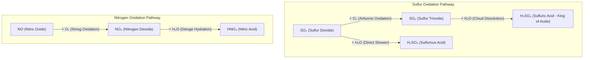

# 🌧️ Acid Rain Environmental Simulation

[](https://www.rust-lang.org/)
[](https://tauri.app/)
[](https://vitejs.dev/)
[](https://developer.mozilla.org/en-US/docs/Web/API/Canvas_API)
[](https://opensource.org/licenses/MIT)

An interactive, gamified environmental simulation software exploring the photochemical formation, atmospheric transport, and ecological consequences of acid rain. Built with a high-performance **Rust (Tauri v2)** backend and a hardware-accelerated **HTML5 Canvas** renderer powered by **Vite**.

Designed for zero-configuration, single-executable deployment on Linux, Windows (x86_64), and macOS (Apple Silicon).

AI vibe-coded projects for education purposes.

---

## 🌟 Key Features

### 1. Dynamic Macroscopic Ecosystem

- **Industrial Factory & Natural Volcano**:
  - **Coal-Fired Power Plant:** Interactive facility on the left. Click to focus and adjust industrial productivity from 10% (idle) to 100% (overload), dynamically scaling $\text{SO}_2$ and $\text{NO}_x$ emission rates, thermal output, and chimney soot opacity.
  - **Volcanic Eruption:** Click the volcano on the far left to trigger an explosive eruption complete with incandescent magma sparks, seismic plumes, and atmospheric emission spikes.
  - **Unified Smoke Plume:** Industrial and volcanic emissions seamlessly merge in the troposphere with selective outer-border glow effects upon cursor hover.
- **Ecological Impact Engine**:
  - **Rain & Lake pH Dynamics:** Real-time acid-base calculations linking emissions directly to precipitation acidity and freshwater lake degradation.
  - **Aquatic Life Simulation:** Fish population dynamically responds to lake pH. Under optimal conditions ($pH \ge 6.0$), fish thrive; under severe acidification ($pH < 4.4$), living fish die off and floating skeletal remains appear.
  - **Forest & Soil Health:** Woodland trees dynamically reflect rainfall pH—from vibrant green canopies to chlorosis stress, down to defoliated dead timber.

### 2. Microscopic Atmospheric Chemistry Playground

- **POV Camera Zoom:** Click directly into the rising smoke plume to transition into high-magnification research mode.
- **Ball-and-Stick Geometric Molecules:** Stationary 2D molecular structures with realistic bonding geometry ($\text{SO}_2$, $\text{O}_2$, $\text{H}_2\text{O}$, $\text{NO}$, $\text{SO}_3$, $\text{NO}_2$, $\text{H}_2\text{SO}_4$, $\text{HNO}_3$, $\text{H}_2\text{SO}_3$).
- **Drag-and-Drop Reactions:** Drag atmospheric oxidants ($\text{O}_2$, $\text{H}_2\text{O}$) into sulfur or nitrogen oxides to trigger spontaneous chemical syntheses accompanied by radial particle bursts.
- **Infinite Reagent Regeneration:** Atmospheric $\text{O}_2$ and humidity ($\text{H}_2\text{O}$) automatically replenish into free space, facilitating continuous discovery.

### 3. Gamification Systems

- **Shooter-Style "Kill Feed":** Real-time synthesis banner in the top-right corner celebrating discovered reactions with distinctive tags (`OXIDIZED`, `ACID FORMED`) and animated fade-outs.
- **Minecraft-Inspired Advancement Tree:**
  - Full-screen modal tracking chemical synthesis progression.
  - XP levels, progress bars, custom tier badges (*Root*, *Rare*, *Legendary*), and mystery hints for locked reaction branches.

---

## 🔬 Atmospheric Reaction Chains

The simulation models both primary pathways of terrestrial acid deposition:



---

## 🏛️ Architecture & Tech Stack

```text
acid_rain/
├── src/                         # Frontend (Vite + Vanilla JS)
│   ├── index.html               # Main viewport & UI drawer markup
│   ├── style.css                # Sci-fi / Minecraft HUD styling
│   ├── main.js                  # App loop, event orchestration & camera
│   ├── chemistry.js             # Molecular models, reaction registry & advancements
│   ├── environment.js           # Terrain, factory, volcano, lake, fish & foliage
│   └── moleculePlayground.js   # 2D geometry renderer & drag-and-drop kinematics
├── src-tauri/                   # Rust Core & Desktop Integration
│   ├── Cargo.toml               # Tauri dependencies & compiler flags
│   ├── tauri.conf.json          # Multi-window config, CSP & app metadata
│   └── src/
│       ├── main.rs              # Desktop executable entry
│       └── lib.rs               # Safe Tauri IPC bridges & plugins
└── package.json                 # Node tooling & scripts
```

- **Frontend:** Pure HTML5 Canvas 2D with zero heavy runtime dependencies, rendering at 60 FPS.
- **Backend:** Tauri v2 with Rust 2024 edition, offering memory safety, minimal RAM footprint (< 50MB), and instant startup.
- **Data-Oriented Principles:** Physics updates and particle systems utilize cache-friendly flat structures avoiding garbage collection stutter.

---

## 🌐 Languages & Localization

The application features a decoupled, scalable internationalization (i18n) architecture. The core application mechanism contains **no hardcoded original text**, only reactive placeholders waiting for language scripts from `src/locales/`:

- **English (`en`):** `src/locales/en.js`
- **Vietnamese (`vi`):** `src/locales/vi.js`

### Choosing Language Before Launching

You can select your language preference before launching the application in several convenient ways:

1. **Via Configuration File (`src/config.js`):**
   Open `src/config.js` and set the `language` property:
   ```javascript
   export const APP_CONFIG = {
     language: "vi", // Set to "vi" for Vietnamese or "en" for English
   };
   ```

2. **Via Pre-Configured NPM Scripts:**
   ```bash
   # Launch in Vietnamese
   npm run dev:vi

   # Launch in English
   npm run dev:en
   ```

3. **Via Environment Variable:**
   ```bash
   VITE_LANGUAGE=vi npm run dev
   ```

4. **Via URL Parameter (Browser Preview):**
   Append `?lang=vi` or `?lang=en` to the local development URL.

### Scaling to New Languages

To add a new language (e.g. Japanese `ja` or French `fr`):
1. Create `src/locales/<lang>.js` by copying `src/locales/en.js` and translating the strings.
2. Register the locale in `src/i18n.js` (`LOCALES`).
3. Set `language: "<lang>"` in `src/config.js`.

---

## 🚀 Getting Started

### Prerequisites

- **Node.js:** v18.0.0 or higher ([Download](https://nodejs.org/))
- **Rust & Cargo:** v1.80.0 or higher ([rustup.rs](https://rustup.rs/))
- **Tauri CLI:**

  ```bash
  cargo install tauri-cli --version "^2.0.0"
  ```

- **OS Dependencies (Linux only):**

  ```bash
  sudo apt-get update && sudo apt-get install -y \
    libwebkit2gtk-4.1-dev \
    build-essential \
    curl \
    wget \
    file \
    libxdo-dev \
    libssl-dev \
    libayatana-appindicator3-dev \
    librsvg2-dev
  ```

### Installation & Development

1. **Clone the repository:**

   ```bash
   https://github.com/tungle2202/acid_rain
   cd acid_rain
   ```

2. **Install frontend packages:**

   ```bash
   npm install
   ```

3. **Run in Tauri Development Mode:**

   ```bash
   npm run tauri dev
   ```

   *This starts the Vite local server and launches the native Tauri desktop window.*

4. **Run Web-Only Preview (Browser Canvas):**

   ```bash
   npm run dev
   ```

---

## 🛠️ Verification & Quality Checks

Run the verification suite across frontend and backend:

```bash
# Frontend build test
npm run build

# Rust checks & unit tests
cargo check --manifest-path src-tauri/Cargo.toml
cargo test --manifest-path src-tauri/Cargo.toml
cargo clippy --manifest-path src-tauri/Cargo.toml -- -D warnings
cargo fmt --manifest-path src-tauri/Cargo.toml --check
```

---

## 📦 Production Build

Bundle into an optimized, self-contained desktop executable:

```bash
npm run tauri build
```

Bundled installers (`.deb`, `.AppImage` on Linux, `.msi` on Windows, `.dmg` on macOS) will be generated under `src-tauri/target/release/bundle/`.

---

## 📜 License

Distributed under the MIT License. See `LICENSE` for further details.
